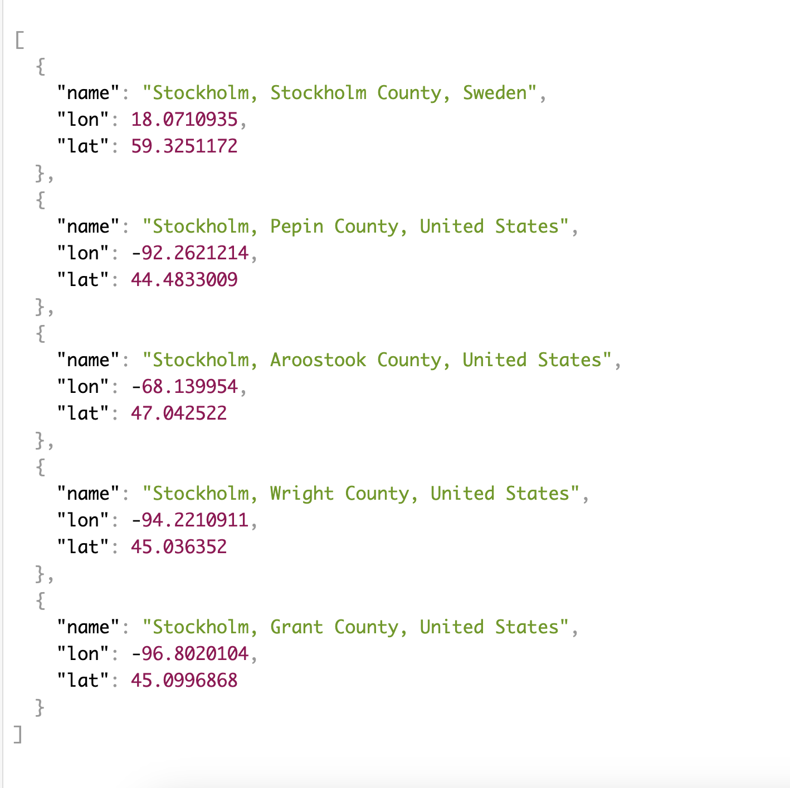
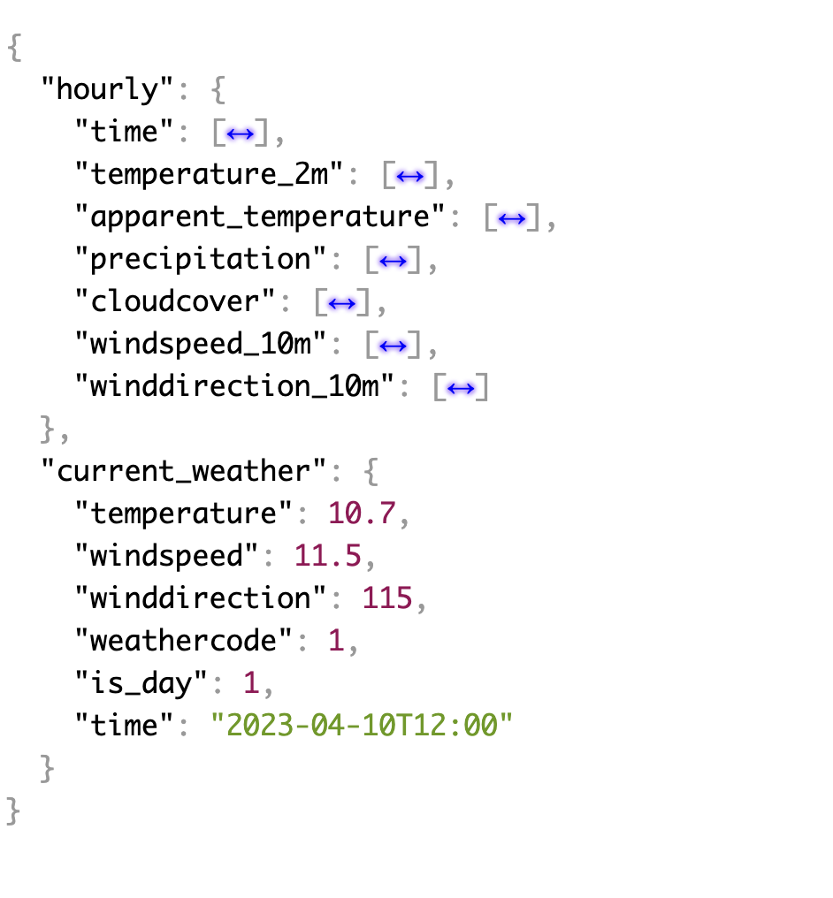

# weather-app-backend
> This app is the backend part of the weather app which uses two external APIs for location autocomplete and weather information.

## General Information
- Geoapify API provided location autocomplete. Geoapify offers a Geocoding REST API that searches addresses all around the world. The REST API operates on the HTTP GET protocol and produces JSON or XML replies. The API is cross-platform and works with the majority of programming languages. An API key is required to utilize the API.

Read more: [geoapify documentation](https://apidocs.geoapify.com/docs/geocoding/forward-geocoding/#about)

The response is a json like the following example

- For the Weather Forecast API, Open-Meteo was used. API can be utilized by selecting the location and weather variables.
The api requires latitude, longitude, and unit to respond, and we provide latitude and longitude via our location api.
Read more: [Open-Meteo documentation](https://open-meteo.com/en/docs)

The response is a json like the following example

<!-- You don't have to answer all the questions - just the ones relevant to your project. -->

<!-- Optional -->
<!-- ## License -->
<!-- This project is open source and available under the [... License](). -->

<!-- You don't have to include all sections - just the one's relevant to your project -->